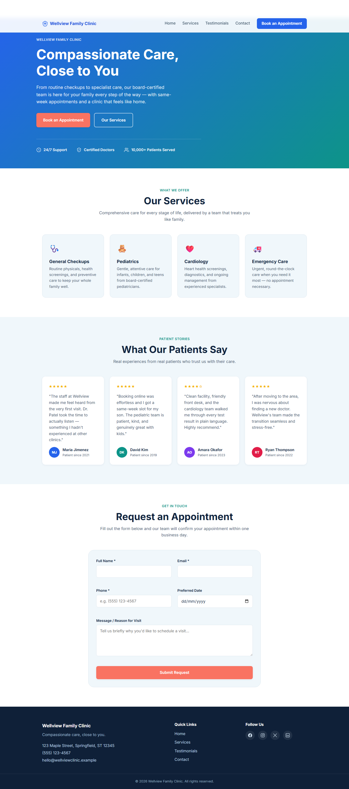

# Wellview Family Clinic

A responsive one-page marketing site for a healthcare clinic, built with plain HTML, CSS, and vanilla JavaScript — no framework, no build step, no dependencies.

**Live site:** https://joeyw1.github.io/Claude-course-/



## Features

- Sticky navbar with smooth-scroll links and a mobile hamburger menu
- Hero section with a pine/marigold palette, Fraunces display type, an animated "care thread" SVG graphic, and call-to-action buttons
- Services and patient testimonials sections with a responsive card grid, tied together by a recurring stitch-divider motif
- Appointment enquiry form with client-side validation and inline error messages (no `alert()`s), submitting live to email via FormSubmit
- Floating WhatsApp chat widget (bottom-right) with a pulsing button and quick-reply suggestions that deep-link into WhatsApp with a pre-filled message
- Scroll-triggered fade-in animations via `IntersectionObserver`
- SEO/schema.org `MedicalClinic` structured data and Open Graph/Twitter meta tags
- Fully responsive, mobile-first layout
- Zero external asset dependencies — icons and avatars are inline SVG/CSS, only Google Fonts (Inter, Fraunces) are loaded remotely

## Project structure

```
index.html   All markup: navbar, hero, services, testimonials, enquiry form, footer, WhatsApp widget
style.css    All styling, organized in commented sections (variables, navbar, hero, ..., WhatsApp widget)
script.js    All behavior: mobile nav toggle, fade-in observer, form handling, WhatsApp widget toggle, footer year
```

## Running locally

No build or install step required.

- Open `index.html` directly in a browser, **or**
- Serve the folder to test relative paths: `python -m http.server`

There is no test suite or linter configured.

## Deployment

The site is deployed automatically to GitHub Pages via GitHub Actions (`.github/workflows/deploy-pages.yml`) on every push to `main`.

## Enquiry form

The form validates Full Name, Email, and Phone as required fields; Preferred Date and Message are optional. On submit it posts to a FormSubmit endpoint (see `FORMSUBMIT_ENDPOINT` in `script.js`) for real email delivery, showing an inline success or error banner.

## WhatsApp chat widget

The floating button in `index.html`'s `#waWidget` links to a WhatsApp number (`wa.me/6592716800`) with pre-filled quick-reply messages for booking, hours, walk-ins, and pricing questions. Toggle behavior lives in `script.js` under "WhatsApp chat widget"; styling is in `style.css` under "WhatsApp Chat Widget".
